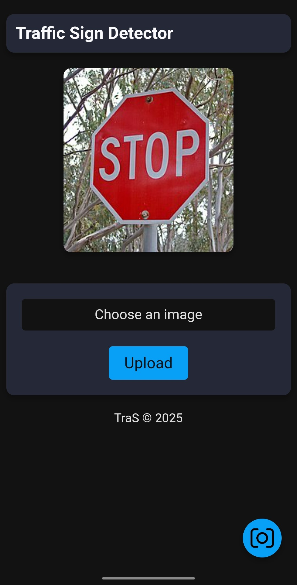
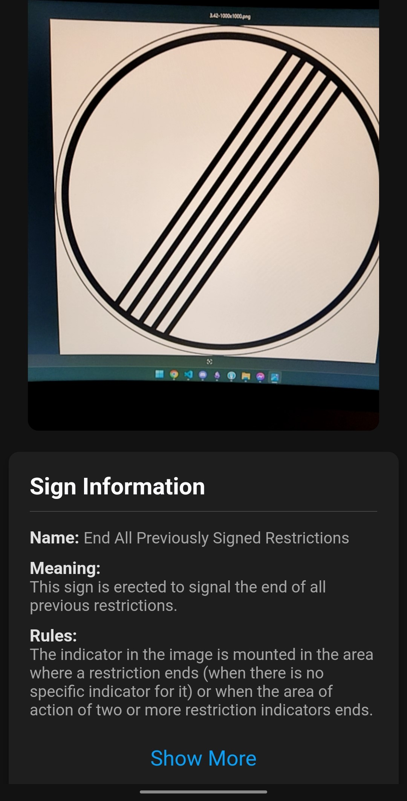
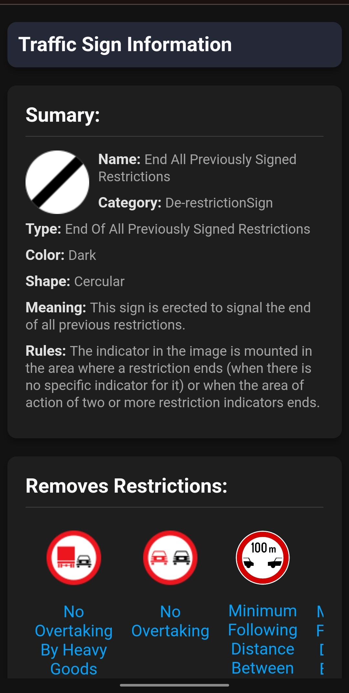

# TraS (Traffic Sign Smart Detector)

## Description

Having several (snapshots of) video recordings – captured via a Webcam or uploaded by a user – regarding an urban route (frequently/randomly) followed by a person or a group of persons (*e.g.*, by using a bike/car/bus), develop a (micro-)service-based Web system able to detect road/traffic signs marking this route (road, highway). This detection process could be performed automatically by using specific public APIs and/or by using user-reported info. A OWL-based conceptual model specified will be created and/or adapted to specify things of interest (mainly, a classification of road/traffic signs and their meanings and legal interpretations). For each recognized (category of) road sign, a SPARQL endpoint will offer various knowledge: meaning, type, legal regulations, relationships to other traffic signs, practical advice, context of use, comparisons, plus suggestions regarding user (driver/pedestrian) behavior.

## Table of Contents
1. [Description](#description)
2. [Requirements](#requirements)
    - [Python](#python)
    - [SSL Certificates](#ssl-certificates)
    - [Configuration](#configuration)
3. [How to Run](#how-to-run)
4. [Pages](#pages)

## Requirements

### Python

Create python virtual environment and install dependencies:

1. `python -m venv myenv`
2. `.\myenv\Scripts\activate`
3. `pip install -r requirements.txt`

### SSL Certificates

You need an HTTPS connection in order to view the camera and use the real-time camera detector. You need to generate an SSL certificate by doing the following in order to accomplish this:

1. Have `openssl` installed:
   * Linux: `sudo apt-get install openssl`
   * Windows: [Download](https://slproweb.com/download/Win64OpenSSL-3_4_0.exe)
2. Go to the root folder
3. Run the following command: `openssl req -x509 -newkey rsa:4096 -keyout key.pem -out cert.pem -days 365 -nodes`

### Configuration

Change the IP from the *static/js/utils.js* to your local IP Address.

## How to Run

1. **Via cmd:** in the root folder use `py ./run.py`
2. **Task:** Using the *Run Flask App* task

## Pages

1. Home page: `<local_ip>:5000`
2. Live camera page: `<local_ip>:5000/camera`
3. About sign page: `<local_ip>:5000/about?sign=sign_name`

## Screenshots

Here is an example of the project in action:

    
    
    

